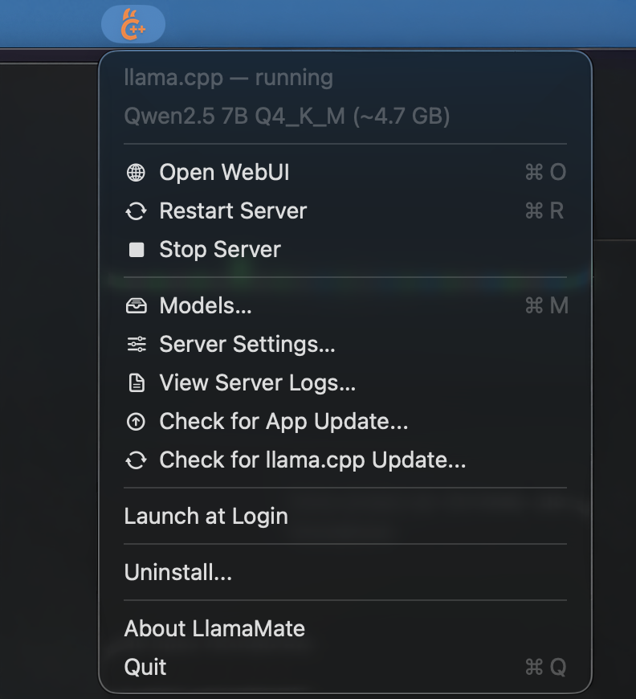
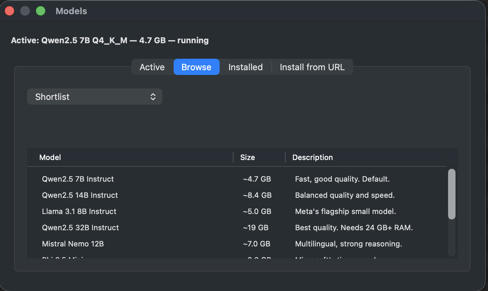
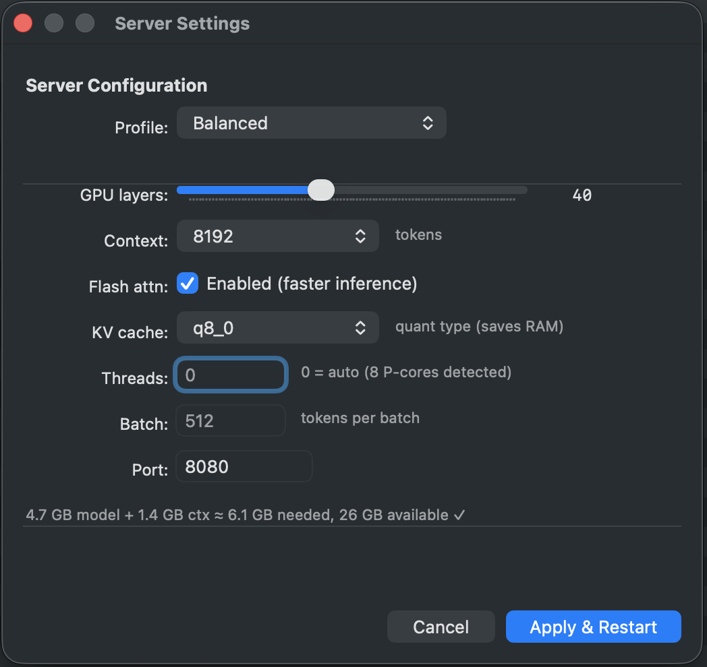

# llama.cpp macOS Installer

A fully automated installer, updater, and manager for [llama.cpp](https://github.com/ggml-org/llama.cpp) on macOS (Apple Silicon & Intel), packaged as a single self-contained menu bar app.

## Screenshots

| Menu bar | Models window |
|----------|---------------|
|  |  |

| Server Settings |
|-----------------|
|  |

### Why this exists

llama.cpp releases ship as bare tarballs — no installer, no PATH setup, no
Gatekeeper handling, no auto-start, no easy update path. Every new build meant
the same manual ritual: download, extract, copy files, fix macOS security warnings,
update the shell RC, restart the server. **LlamaMate** wraps the entire
process into a single `.app` so you never think about it again.

## Features

- **One-click install** — download the `.app`, double-click, press **Install**
- **Self-contained** — `install-llama.sh` is bundled inside the `.app`; no separate script
- **Automatic architecture detection** — universal binary (arm64 + x86_64)
- **Menu bar control** — start / stop / restart, status icon (green = running)
- **Model downloads** — built-in presets (Qwen2.5 7B, 14B, Llama 3.1 8B, Qwen2.5 32B) via Hugging Face
- **Auto-start at login** — optional LaunchAgent for background server operation
- **App auto-update** — checks GitHub releases; one-click download
- **llama.cpp update** — check / apply from inside the app
- **Gatekeeper handling** — ad-hoc codesign + quarantine removal baked into the build
- **Shell configuration** — automatically sets up `PATH` and `DYLD_LIBRARY_PATH` in your shell RC file
- **One-click uninstall** — removes everything: server, LaunchAgent, binaries, libraries, config, models, shell RC entries, and the app itself

## Quick Start

### Install

**Via Homebrew (recommended if you have Homebrew):**
```bash
brew tap Ito-69/llamamate
brew install --cask llamamate
```

**Via DMG (no Homebrew required):**
1. Download `LlamaMate-2.x.x.dmg` from [GitHub Releases](https://github.com/Ito-69/llama.cpp_install_on_macos/releases)
2. Open the `.dmg` and drag `LlamaMate.app` to `/Applications`
3. **Right-click → Open** the first time (because the app is not notarized)
4. Click **Install** in the welcome dialog

The app handles everything: downloads llama.cpp, downloads a model, sets up the LaunchAgent, and starts the server. You'll see a green llama icon in your menu bar when it's running.

### Use

| URL | What it is |
|-----|------------|
| `http://127.0.0.1:8080` | WebUI — chat with the AI agent |
| `http://127.0.0.1:8080/health` | Health check endpoint |
| `http://127.0.0.1:8080/v1` | OpenAI-compatible API |

Quick test via terminal:

```bash
curl http://127.0.0.1:8080/v1/chat/completions \
  -H "Content-Type: application/json" \
  -d '{
    "model": "llama",
    "messages": [{"role": "user", "content": "Hello!"}]
  }'
```

The WebUI supports chat, PDF/image attachments, multiple conversations, JSON schema output, and more — all fully local.

## Menu Bar App

The app lives in your menu bar with a green llama icon (faded = stopped, full = running). Click it to access:

| Menu item | Description |
|-----------|-------------|
| `Open WebUI` | Open `http://127.0.0.1:8080` in your browser (⌘O) |
| `Start Server` / `Stop Server` / `Restart Server` | Control the llama-server LaunchAgent |
| `Models…` | Open the Models window (browse, download, activate, delete) |
| `Server Settings…` | Open the Server Settings window (profiles, GPU layers, context, flash attention, KV cache, threads, batch size, port) |
| `View Server Logs…` | Open the Log Viewer (auto-refreshing tail of `~/Library/Logs/llama-server.log`) |
| `Check for App Update...` | Check for a newer LlamaMate release on GitHub |
| `Check for llama.cpp Update...` | Check for a newer llama.cpp build |
| `Apply llama.cpp Update...` | Download and install the latest llama.cpp build |
| `Launch at Login` | Toggle auto-start of the menu bar app itself |
| `Uninstall...` | Remove everything (with option to keep models) |
| `About LlamaMate` | Show version and GitHub link |
| `Quit` | Exit the menu bar app (⌘Q) |

The status icon polls every 5 seconds.

## Managing Models

Click **Models…** in the menu bar to open a dedicated window with four tabs:

### Active

Shows the current active model — its label, file size, and whether the server is running. Use this as a starting point to change models.

### Browse

Two modes via a dropdown:

- **Shortlist** — 10 curated popular GGUF models (Qwen2.5, Llama 3.1, Mistral Nemo, Phi 3.5, Gemma 2, DeepSeek R1, etc.) with descriptions and approximate sizes. Double-click to pick.
- **Search** — search Hugging Face for any GGUF model by name. Results sorted by downloads.

After picking a repo, a file picker shows all available `.gguf` quantizations with sizes from Hugging Face. Pick one and click **Download** — the progress bar and live log appear in the same window. Once finished, you're asked "Use this model now?" — Yes updates the server config and restarts the LaunchAgent; No just keeps the file in `~/models/` for later.

### Installed

Lists every `.gguf` file in `~/models/`. The currently active model is marked with ✓. Right-click or use the buttons:

- **Make Active** — switches to that model and restarts the server
- **Delete…** — removes the file from disk (with confirmation)

### Install from URL

Paste any of these and click **Fetch**:

- `https://huggingface.co/<owner>/<repo>` — opens the file picker
- `https://huggingface.co/<owner>/<repo>/resolve/main/<file>.gguf` — skips the picker and goes straight to download
- `<owner>/<repo>` — bare repo id

### Tips

- Without a Hugging Face token, downloads are rate-limited. The app prompts for one on first install. You can add a token later from the welcome dialog.
- The download uses `huggingface_hub` (Python) which supports resumable downloads.
- All downloaded models land in `~/models/`. Delete them anytime from the Installed tab.

## Server Settings

Click **Server Settings…** in the menu bar to tune `llama-server` parameters without touching the terminal. The window auto-detects Apple Silicon vs Intel and adjusts presets accordingly.

### Profiles

Three presets that set GPU layers, flash attention, and KV cache quantization together:

| Profile | Apple Silicon (M1–M4) | Intel Mac |
|---------|-----------------------|-----------|
| **Fast** | `-ngl 99` `-fa 1` `-ctk q8_0` | `-ngl 1` |
| **Balanced** *(default)* | `-ngl 40` `-fa 1` `-ctk q8_0` | CPU only |
| **Accurate** | `-ngl 99` no KV cache opts | CPU only |

### Individual controls

| Control | What it does |
|---------|-------------|
| **GPU layers** | Number of layers offloaded to GPU (0–99). On Apple Silicon, Metal acceleration makes this the single biggest speedup — always set to 99. |
| **Context** | Context size in tokens (2048–32768). Larger = more memory, better for long conversations. |
| **Flash attention** | Faster inference with most models. Always enabled on Apple Silicon Fast/Balanced profiles. |
| **KV cache type** | Quantization for key/value cache: `f16` (full precision), `q8_0` (8-bit, saves RAM), `q4_0` (4-bit, maximum RAM saving). |
| **Threads** | CPU threads for prompt processing. `0` = auto. On Apple Silicon, optimal is the number of P-cores (not logical cores). |
| **Batch size** | Tokens processed per batch. `512` is a good default. |
| **Port** | HTTP server port (default `8080`). |

### RAM safety

When you apply settings, the window shows an estimate of model + context RAM vs your system's available memory. If the estimate exceeds available RAM, a warning is shown. The start script also checks before launching `llama-server` and logs a warning if the model is likely too large.

## Build from Source

```bash
# Build the universal .app
cd llamamate
./build.sh

# Copy to /Applications
cp -r LlamaMate.app /Applications/

# Open
open /Applications/LlamaMate.app
```

Build outputs:
- `LlamaMate.app` — universal binary (arm64 + x86_64), ad-hoc codesigned
- macOS 13+ required

## Release Process

Releases are automated via a single workflow:

```bash
# 1. Bump VERSION in llamamate/build.sh
# 2. Build the DMG and publish
bash release.sh 2.3.3
gh release create v2.3.3 --target main "release-out/LlamaMate-2.3.3.dmg"
```

The `.github/workflows/update-homebrew-tap.yml` workflow fires on release publish:
1. Downloads the DMG and computes its SHA256
2. Updates `Casks/llamamate.rb` in `Ito-69/homebrew-llamamate`
3. Opens a PR with the change

**Setup required (one time):** create a [GitHub Personal Access Token](https://github.com/settings/tokens?type=beta) with `contents:write` scope on `homebrew-llamamate` and add it as `TAP_REPO_TOKEN` secret in this repository's settings.

## Files & Directories

| Path | Purpose |
|------|---------|
| `~/.local/bin/` | llama.cpp binaries (`llama-server`, `llama-cli`, …) |
| `~/.local/lib/` | Shared libraries (`libllama*.dylib`, `libggml*.dylib`) |
| `~/models/` | GGUF model files |
| `~/.config/llama/server.conf` | Server configuration |
| `~/Library/Application Support/LlamaMate/` | App support (bundled script) |
| `~/Library/LaunchAgents/com.llama.cpp.server.plist` | LaunchAgent (auto-start server) |
| `~/Library/Logs/llama-server.log` | Server stdout (background mode) |
| `~/Library/Logs/llama-server.err.log` | Server stderr (background mode) |

## Uninstallation

Click **Uninstall...** in the menu bar app. Choose:

- **Remove Everything** — server, LaunchAgent, binaries, libraries, config, app support, shell RC entries, and downloaded models
- **Keep Models** — same as above but keeps `~/models/*.gguf`
- **Cancel** — do nothing

The app removes itself from `/Applications` after quitting.

## Requirements

- macOS 13+ (Ventura or newer)
- Xcode Command Line Tools: `xcode-select --install`
- Internet connection (for initial download + model fetch)

The app installs its own `huggingface_hub` Python package on first run.

## License

MIT — feel free to use, modify, and share.

---

*Inspired by the [llama.cpp](https://github.com/ggml-org/llama.cpp) project by ggerganov.*
